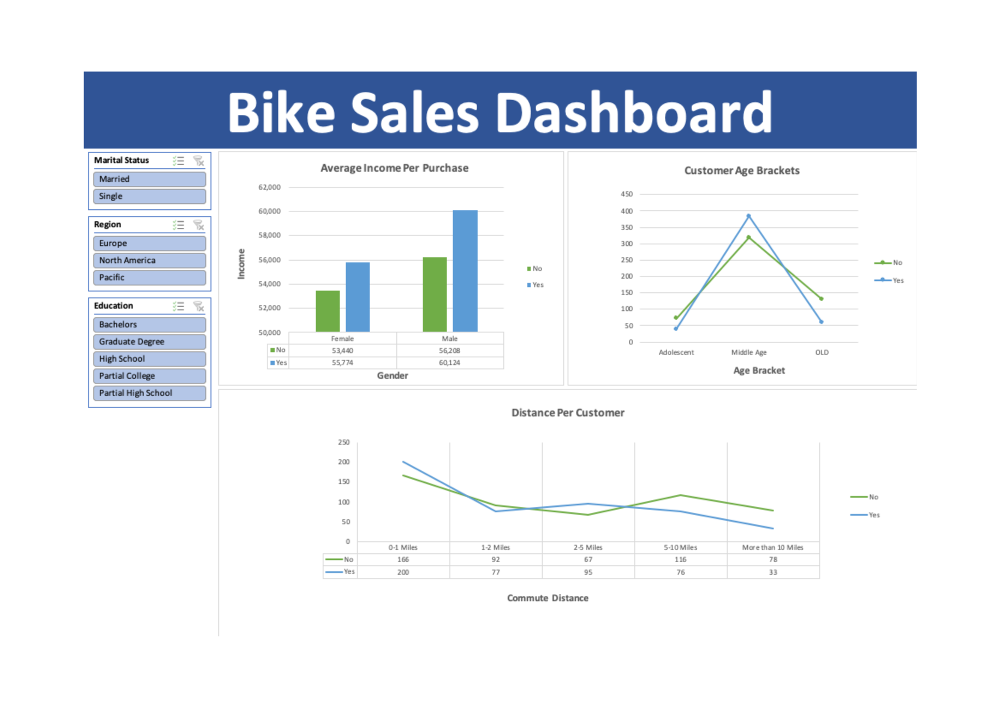

# 🚲 Bike Sales Dashboard – Excel Project

## 📌 Project Overview

This project analyzes customer data to understand bike purchasing behavior
across different customer segments.

I used Microsoft Excel to clean and prepare the data, perform analysis using
Pivot Tables and lookup functions, and build an interactive dashboard to
visualize purchasing patterns.

## 📊 Dashboard Preview

## 🎯 Project Objectives

- Analyze customer bike purchasing behavior
- Compare average income by gender and purchase status
- Analyze purchasing patterns across different age groups
- Examine the relationship between commute distance and bike purchases
- Explore customer segments using interactive filters

## 🛠️ Tools & Skills Used

- Microsoft Excel
- Data Cleaning
- Pivot Tables
- Pivot Charts
- VLOOKUP
- XLOOKUP
- Excel Formulas
- Slicers
- Data Visualization
- Interactive Dashboard Development

## 🔍 Dashboard Analysis

### 💰 Average Income Per Purchase
Analyzed average income by gender and compared customers who purchased
a bike with those who did not.

### 👥 Customer Age Brackets
Analyzed bike purchasing behavior across different age groups to understand
which customer segments showed higher purchase activity.

### 🚲 Commute Distance
Compared bike purchase decisions across different commute-distance groups.

### 🎛️ Interactive Filters
The dashboard includes slicers for:

- Marital Status
- Region
- Education

These slicers allow users to dynamically filter the dashboard and explore
different customer segments.

## 📁 Workbook Structure

| Sheet | Description |
|---|---|
| `bike_buyers` | Original customer dataset |
| `Working Sheet` | Data cleaning and preparation |
| `Pivot Table` | Pivot Tables used for analysis |
| `Final Dashboard` | Final interactive Excel dashboard |

## 💡 Key Skills Demonstrated

- Cleaning and preparing data in Excel
- Using VLOOKUP and XLOOKUP
- Creating and analyzing Pivot Tables
- Creating Pivot Charts
- Building interactive slicers
- Designing an Excel dashboard
- Analyzing customer purchasing patterns
- Presenting insights through data visualization

## 👤 Author

**Md. Ove Rahman**  
Data Analyst | Business Intelligence (BI) Analyst
