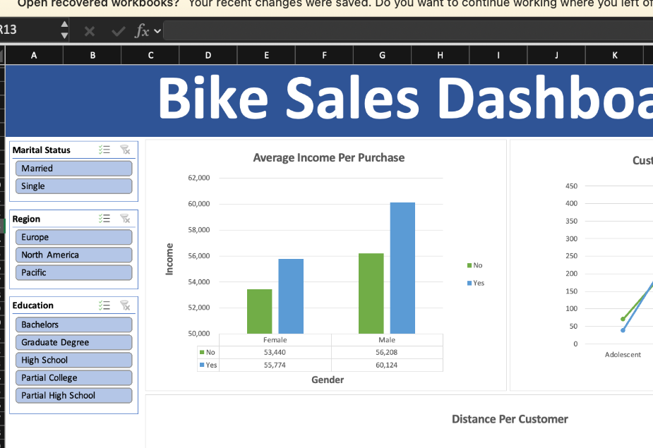

# 🚲 Bike Sales Dashboard | Excel

## 📌 Project Overview
This project analyzes customer data to understand the factors influencing
bike purchasing behavior.

Using Microsoft Excel, I cleaned and prepared the dataset, performed analysis
with Pivot Tables and lookup functions, and developed an interactive dashboard
to visualize customer purchasing patterns.

## 🎯 Project Objectives
- Analyze bike purchasing behavior across different customer segments
- Compare average income and bike purchase decisions
- Analyze purchasing patterns across different age groups
- Examine the relationship between commute distance and bike purchases
- Build an interactive dashboard for easy data exploration

## 🛠️ Tools & Excel Skills
- Microsoft Excel
- Data Cleaning & Preparation
- Pivot Tables
- Pivot Charts
- VLOOKUP
- XLOOKUP
- Excel Formulas
- Slicers
- Data Visualization
- Interactive Dashboard Development

## 📊 Dashboard Analysis

### 💰 Average Income Per Purchase
Analyzed average income by gender and compared customers who purchased
a bike with those who did not.

### 👥 Customer Age Brackets
Compared bike purchasing behavior across different age groups to identify
customer segments with higher purchase activity.

### 🚗 Commute Distance
Analyzed how commute distance relates to customers' bike purchasing decisions.

## 🎛️ Interactive Filters
The dashboard includes interactive slicers for:

- Marital Status
- Region
- Education

These filters allow users to dynamically explore customer segments and
update the dashboard visualizations.

## 📁 Workbook Structure

| Sheet | Purpose |
|---|---|
| `bike_buyers` | Original dataset |
| `Working Sheet` | Data cleaning and preparation |
| `Pivot Table` | Pivot-based analysis |
| `Final Dashboard` | Interactive Excel dashboard |

## 📷 Dashboard Preview

## 💡 Skills Demonstrated
This project demonstrates my ability to:

- Clean and prepare data in Excel
- Use VLOOKUP and XLOOKUP for data retrieval
- Analyze datasets using Pivot Tables
- Create Pivot Charts and visualizations
- Build interactive dashboards using slicers
- Analyze customer and sales-related data
- Present analytical results in a clear visual format

## 👤 Author

**Md. Ove Rahman**  
Data Analyst | Business Intelligence (BI) Analyst

- GitHub: `ovir18`
- Portfolio: `ovir18.github.io`
